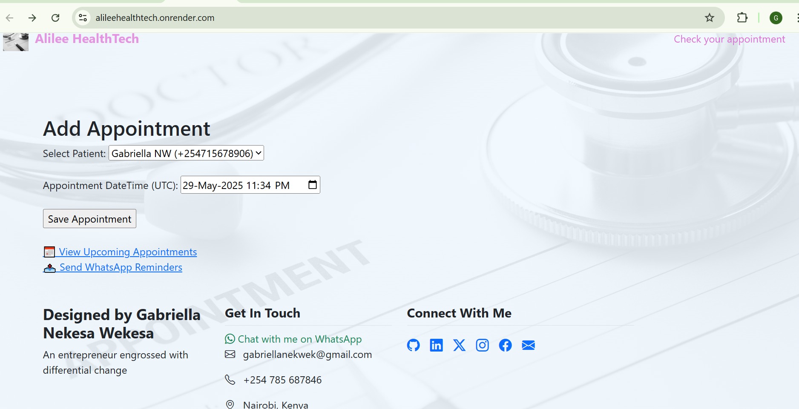

# AlileeHealthTech

Render Deployment https://alileehealthtech.onrender.com/

A healthcare appointment reminder system with WhatsApp/SMS notifications, built with Python/Flask and Supabase.

**Live Demo**: [https://alileehealthtech.onrender.com](https://alileehealthtech.onrender.com)

## Screenshot


## Screenshot
Presentation  https://gamma.app/docs/Alilee-HealthTech-6vo99sd8vex7a48


## Features
- 📅 Automated appointment reminders via WhatsApp/SMS
- 🏥 Patient management dashboard
- ⚡ Real-time Supabase integration
- 🔔 Background scheduler for reminders
- 📱 Twilio API integration for messaging

## Installation
1. Clone repository
   ```bash
   git clone https://github.com/yourusername/AlileeHealthTech.git
   cd AlileeHealthTech

2. Create virtual environment (Windows)

python -m venv myvenv
.\myvenv\Scripts\activate

3. Install dependencies

pip install -r requirements.txt

4. Configure environment

Create .env file with:


SUPABASE_URL=your_supabase_url
SUPABASE_KEY=your_supabase_key
TWILIO_ACCOUNT_SID=your_twilio_sid
TWILIO_AUTH_TOKEN=your_twilio_token

5. Run application

python app.py

 
Configuration
Environment Variable	Description
SUPABASE_URL	        Supabase project URL
SUPABASE_KEY	        Supabase anon/public key
TWILIO_ACCOUNT_SID  	Twilio account SID
TWILIO_AUTH_TOKEN	    Twilio auth token
Note: WhatsApp templates must be pre-approved through Twilio Console.

Deployment
Deployed on Render using:

Web Service: Python environment

Start Command: ./start.sh

Environment Variables: Set in Render dashboard

Technologies
Python 3.11

Flask

Supabase

Twilio API

Render Cloud
---

🙌 **Thanks for visiting!**  
If you have questions or feedback, feel free to:  
- 📧 Email: [gabriellanekwek@gmail.com](mailto:gabriellanekwek@gmail.com)  
- 🌟 Star this repo if you found it useful!  